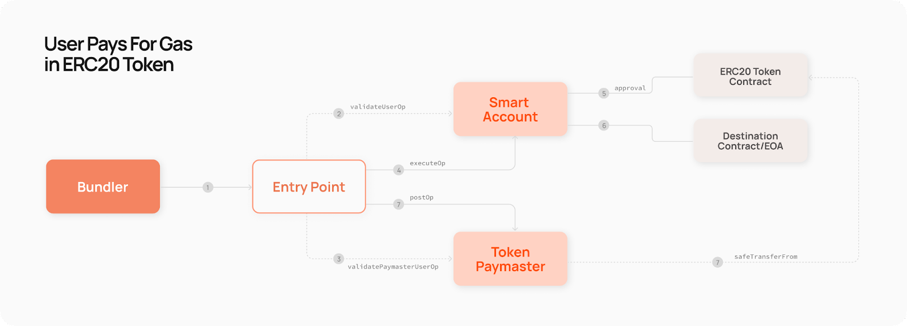
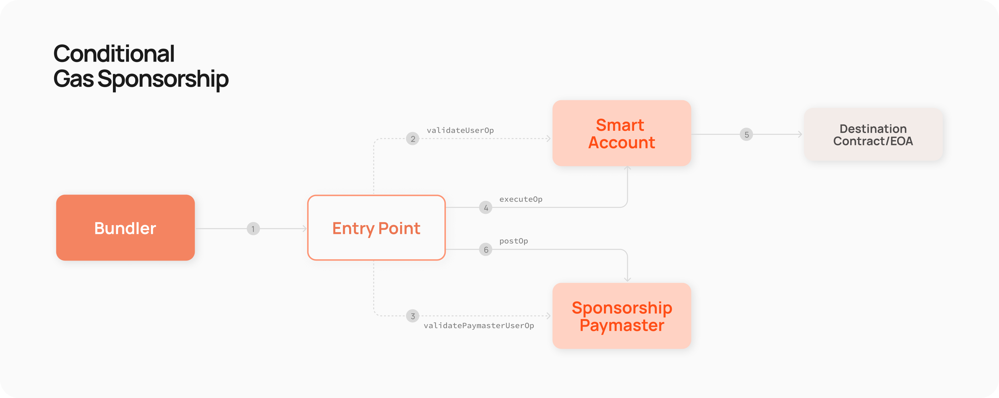

# Biconomy Paymasters 🌐

Welcome to the `biconomy-paymasters`` repository! Paymaster contracts enable seamless userOp fee handling in decentralized applications, offering innovative solutions similar to traditional web2 payment processing models. 🛠️

## What are Biconomy Paymasters? 🤔

Biconomy Paymasters, structured as smart contracts, streamline the management of gas fees, offering end-users the convenience of executing user operations without gas costs or the flexibility to pay fees with ERC20 tokens. 🚀

- **Verifying (Sponsorship) Paymaster**: Allows transactions without end-users needing to pay for gas, enhancing UX.
- **Token Paymaster**: Provides the ability to pay for transactions with ERC20 tokens.

## Features 🌟

- Simplified transaction fee handling.
- ERC 4337 Account Abstraction compliant.
- Multi-token support for gas payments.
- Hybrid Paymaster approach, combining gas sponsorship and token-based payments into a single, streamlined solution.

## Upcoming Features (Work in Progress)
- Fiat Paymaster (WIP): Planned feature to allow users to pay gas fees using fiat currency.
- Deposit Paymaster (WIP): Intended to enable Dapp deposit sponsorship in various tokens.

### ERC20 Token Paymaster



- ERC20 Token Paymaster helps users pay for their transactions using ERC20 tokens.
- Users initiate a transaction using an ERC20 token.
- Paymaster validates the transaction and covers the userOp fees.This flow ensures ease of use and convenience for users.

### Verifying (Sponsorship) Paymaster



- Users initiate the process with their userOps.
- The operation is checked against the requirements set by the Sponsorship (Verifying) Paymaster.
- Once verified and approved, the Paymaster sponsors the gas fees.
- This process ensures userOps are confirmed on the network without users incurring gas costs.

Note: The Paymaster's approval process is crucial, requiring a verifying party's signature to confirm sponsorship eligibility for each userOp​​.

## Getting Started 🏁

To set up and use the Biconomy Paymasters, you'll need to have Node.js, Yarn, Hardhat, and Foundry installed.

### Prerequisites 📋

Make sure you have Node.js and Yarn installed. You will also need to install Foundry for smart contract development with Solidity.

### Installation 📦

Clone the repository and install the dependencies with `yarn`:

```bash
git clone https://github.com/bcnmy/biconomy-paymasters.git
cd biconomy-paymasters
yarn install
```

### Building the Project 🏗️

Compile your smart contracts and generate typechain artifacts:

```bash
yarn build
```

### Running Tests 🧪

After building, run your tests to ensure everything is working correctly:

```bash
yarn test
```

This will run both Hardhat and Foundry tests as specified in your `package.json` scripts.

## Documentation 📚

For more detailed information about Paymasters and how to integrate them into your project, visit the [Biconomy Paymaster Documentation](https://docs.biconomy.io/category/paymaster).

## Foundry Installation

For instructions on how to set up Foundryfollow the instructions provided in the [Foundry Book](https://book.getfoundry.sh/getting-started/installation.html).

## Contributing 🤝

We welcome contributions from the community. Please take a look at the [guidelines for contributions](./CONTRIBUTING.md).

## License 📜

This project is licensed under the MIT License. See the [`LICENSE`](./LICENSE.md) file for more information.
